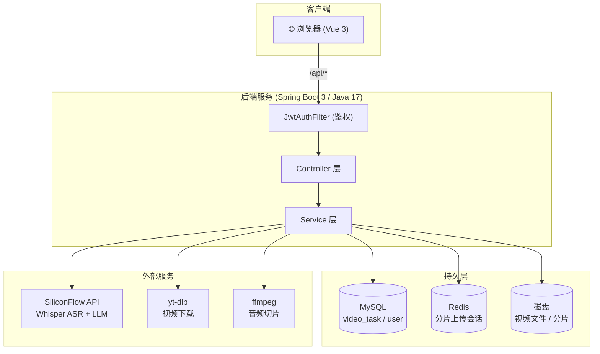
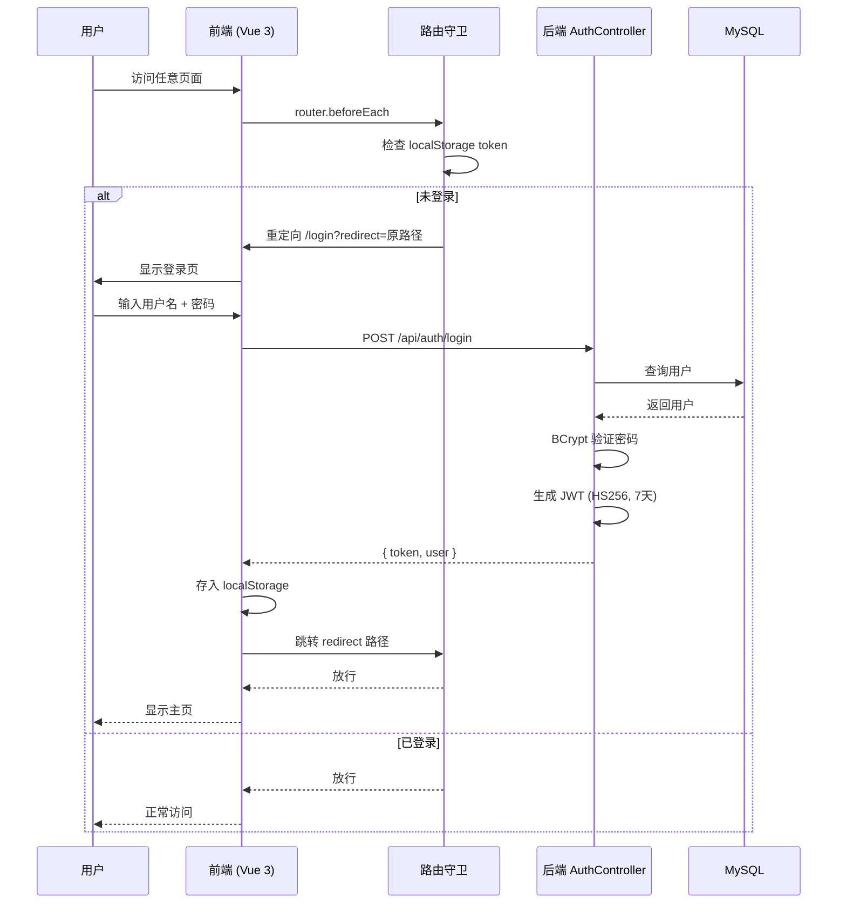
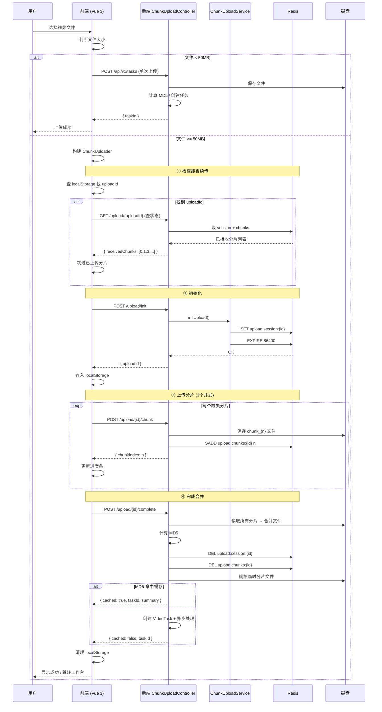
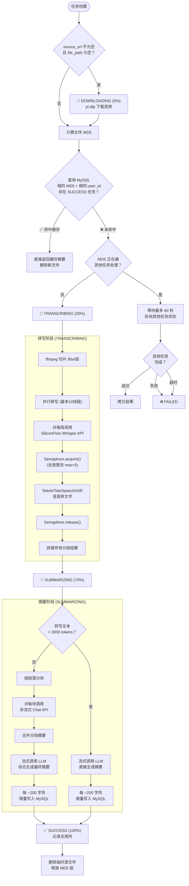
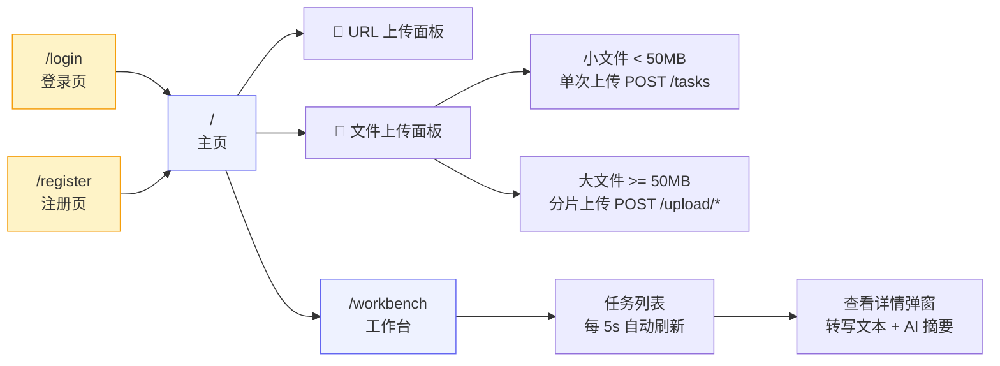

# AiVideoSummary 🎬 → 📝

AI 视频摘要服务：自动下载视频、语音转文字、AI 生成结构化摘要。

---

## 项目流程图

### 1. 系统架构总览



---

### 2. 用户鉴权流程



---

### 3. 视频上传流程（分片上传 + 断点续传）



---

### 4. 视频处理核心流程



---

### 5. 前端页面路由



---

## 技术栈

| 层面 | 技术 | 版本 |
|---|---|---|
| 语言/框架 | Java 17 + Spring Boot 3 | 3.5.14 |
| 构建工具 | Maven (mvnw wrapper) | - |
| ORM | MyBatis-Plus | 3.5.15 |
| 数据库 | MySQL 8 | - |
| 缓存 | Redis | - |
| AI 编排 | LangChain4j (core + open-ai) | 1.15.0 |
| ASR 语音识别 | SiliconFlow Whisper API (`TeleAI/TeleSpeechASR`) | - |
| LLM 总结 | SiliconFlow Chat API (`tencent/Hunyuan-MT-7B`) | - |
| 视频下载 | yt-dlp | 系统 CLI |
| 音频处理 | ffmpeg | 系统 CLI |

---

## 项目结构

```
AiVideoSummary/
├── pom.xml                              # Maven 项目配置
├── HELP.md                              # Spring Boot 入门指南
├── LICENSE                              # MIT 许可证
├── summary-prompt.txt                   # 总结提示词草稿
├── uploads/                             # 上传/下载文件临时目录
│
├── src/main/java/com/example/aispringvideo/
│   ├── AispringVideoApplication.java    # 应用入口
│   ├── config/
│   │   ├── LangChain4jConfig.java       # ASR + LLM 模型 Bean 配置
│   │   └── WebConfig.java              # JWT Filter 注册
│   ├── auth/
│   │   ├── JwtUtil.java                # JWT 生成/验证
│   │   └── JwtAuthFilter.java          # 鉴权过滤器
│   ├── controller/
│   │   ├── AuthController.java         # 注册/登录
│   │   ├── VideoTaskController.java    # 视频任务 API
│   │   └── ChunkUploadController.java  # 分片上传 API
│   ├── entity/
│   │   ├── User.java                   # 用户实体
│   │   ├── VideoTask.java              # 视频任务实体
│   │   └── UploadSession.java          # 上传会话模型（内存）
│   ├── mapper/
│   │   ├── UserMapper.java
│   │   └── VideoTaskMapper.java
│   └── service/
│       ├── UserService.java + impl
│       ├── IVideoTaskService.java + impl
│       ├── TaskProcessService.java     # 核心编排服务
│       └── ChunkUploadService.java     # 分片上传 + Redis
│
├── src/main/resources/
│   ├── application.properties           # 应用配置
│   └── mapper/
│       └── VideoTaskMapper.xml
│
└── sql/
    └── migration.sql                    # 数据库迁移
```

---

## 快速开始

### 前置条件

- JDK 17+
- MySQL 8.x
- Redis
- ffmpeg（已加入系统 PATH）
- yt-dlp（已加入系统 PATH）
- SiliconFlow API Key（[前往注册](https://siliconflow.cn)）

### 配置

编辑 `src/main/resources/application.properties`：

```properties
# 数据库配置
spring.datasource.url=jdbc:mysql://localhost:3306/video
spring.datasource.username=root
spring.datasource.password=your_password

# SiliconFlow API 配置
siliconflow.api-key=sk-your-api-key-here
siliconflow.base-url=https://api.siliconflow.cn/v1
```

### 运行

```bash
# 使用 Maven 包装器
./mvnw spring-boot:run

# 或打包后运行
./mvnw clean package -DskipTests
java -jar target/AiVideoSummary-0.0.1-SNAPSHOT.jar
```

---

## API 文档

### 用户鉴权

```http
POST /api/auth/register
Content-Type: application/json

{ "username": "xxx", "password": "123456" }

Response: { "token": "eyJ...", "user": { "id": 1, "username": "xxx" } }
```

```http
POST /api/auth/login
Content-Type: application/json

{ "username": "xxx", "password": "123456" }

Response: { "token": "eyJ...", "user": { "id": 1, "username": "xxx" } }
```

### 上传视频文件

```http
POST /api/v1/tasks
Content-Type: multipart/form-data
Authorization: Bearer <token>

file=@/path/to/video.mp4
```

### 分片上传

```http
# 1. 初始化
POST /api/v1/tasks/upload/init
Authorization: Bearer <token>
Content-Type: application/json

{ "filename": "demo.mp4", "fileSize": 524288000, "totalChunks": 100, "chunkSize": 5242880 }
→ { "uploadId": "abc123" }

# 2. 上传单个分片
POST /api/v1/tasks/upload/{uploadId}/chunk
Authorization: Bearer <token>
Content-Type: multipart/form-data

chunk=0  file=@chunk_data
→ { "chunkIndex": 0 }

# 3. 查询已上传分片（用于续传）
GET /api/v1/tasks/upload/{uploadId}
Authorization: Bearer <token>
→ { "receivedChunks": [0,1,2,4,5], "totalChunks": 100, "progress": 72 }

# 4. 完成合并
POST /api/v1/tasks/upload/{uploadId}/complete
Authorization: Bearer <token>
Content-Type: multipart/form-data

filename=demo.mp4
→ { "taskId": 42, "cached": false }
```

### 提交视频 URL

```http
POST /api/v1/tasks/from-url
Authorization: Bearer <token>
Content-Type: application/x-www-form-urlencoded

url=https://www.bilibili.com/video/BV1xx411c7mD
```

### 查询任务

```http
GET /api/v1/tasks/list
Authorization: Bearer <token>
→ { "data": [ { "id": 42, "status": "TRANSCRIBING", ... } ] }

GET /api/v1/tasks/Json?id=42
Authorization: Bearer <token>
→ { "data": { "id": 42, "transcript": "...", "summary": "..." } }
```

---

## 核心流程

```
用户上传/URL → PENDING
                 ↓
            DOWNLOADING (yt-dlp 下载音频)   ← 仅 URL 模式
                 ↓
            TRANSCRIBING (SiliconFlow ASR)
                 ├─ ffmpeg 切割 90s 片段
                 └─ 并行 10 线程转写 → 拼接全文
                 ↓
            SUMMARIZING (LLM 总结)
                 ├─ 文本 < 3000 tokens → 直接总结
                 └─ 长文本 → 分块总结 → 合并再总结
                 ↓
            SUCCESS / FAILED
```

### 状态机

| 状态 | 进度 | 说明 |
|---|---|---|
| `PENDING` | 0% | 任务已创建，等待处理 |
| `DOWNLOADING` | 5% | 正在下载视频/音频 |
| `TRANSCRIBING` | 20% | 正在语音转文字 |
| `SUMMARIZING` | 70% | 正在 AI 生成摘要 |
| `SUCCESS` | 100% | 处理完成 |
| `FAILED` | - | 处理失败 |

---

## 机制说明

- **并行转写**：将音频按 90 秒切片，使用线程池（最多 10 线程）并行调用 ASR API，显著缩短转写时间
- **长文本处理**：当转写文本超过单次 token 限制（3000 tokens）时，自动分块总结后合并再总结
- **流式输出**：采用 StreamingChatModel 实时流式输出摘要，每 ~200 字符增量写入数据库
- **MD5 去重**：上传时计算文件 MD5，检测到已成功处理过的视频直接返回缓存结果
- **分片上传**：大文件（>50MB）自动切换分片上传，3 并发，支持断点续传和自动重试
- **Semaphore 限流**：全局信号量限制 SiliconFlow API 并发，避免触发限流
- **JWT 鉴权**：注册/登录后获取 JWT，后续请求通过 Authorization header 验证，任务按用户隔离

---

## TODO / 改进方向

- [ ] **安全加固**：将 API Key 和数据库密码改用环境变量或外部配置
- [ ] **错误处理**：添加全局异常处理器
- [ ] **CI/CD**：配置 GitHub Actions 自动构建
- [ ] **Docker**：容器化部署
- [ ] **监控**：添加日志和性能监控

## 许可证

[MIT](LICENSE)
